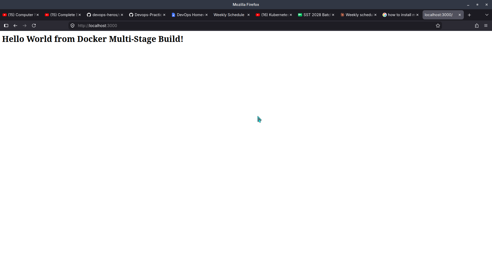
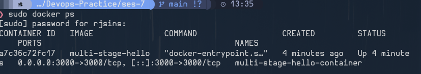

# Docker Multi-Stage Build

## Student Details

  Field                   Details
  ----------------------- --------------------------
  **Name**                Monika Bhardwaj
  **Enrollment Number**   10333
  **Course / Subject**    DevOps
  **Assignment**          Docker Multi-Stage Build

## Task 1: Docker Multi-Stage Build

The Docker application was successfully built using a multi-stage
Dockerfile and run as a container.

### Build

``` bash
docker build -t multi-stage-hello .
```

### Run

``` bash
docker run -d -p 3000:3000 --name multi-stage-hello-container multi-stage-hello
```

### Application Output

The application was successfully accessed through the browser and
displayed:

**Hello World from Docker Multi-Stage Build!**



## Task 2: Container Verification

The running container was verified using:

``` bash
docker ps
```

The container `multi-stage-hello-container` is running with the port
mapping:

``` text
0.0.0.0:3000 -> 3000/tcp
```



## Note on Port 8080

The assignment specifies port **8080**, whereas the submitted evidence
shows the application running on **port 3000**. The screenshots
therefore document the successful deployment on port 3000.

If port 8080 is required, the container can be exposed using the
appropriate port mapping, for example:

``` bash
docker run -d -p 8080:3000 --name multi-stage-hello-container multi-stage-hello
```

## Task 3: Docker Application Deployment

Docker can also be used to deploy applications written in different
technologies, including:

-   **Node.js**
-   **Python**
-   **Java**

## Conclusion

The Docker multi-stage application was successfully built, deployed,
accessed through the browser, and verified using `docker ps`.
